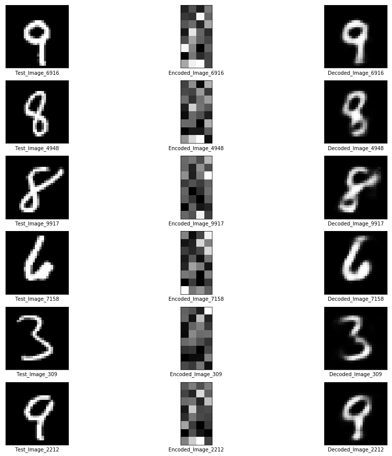
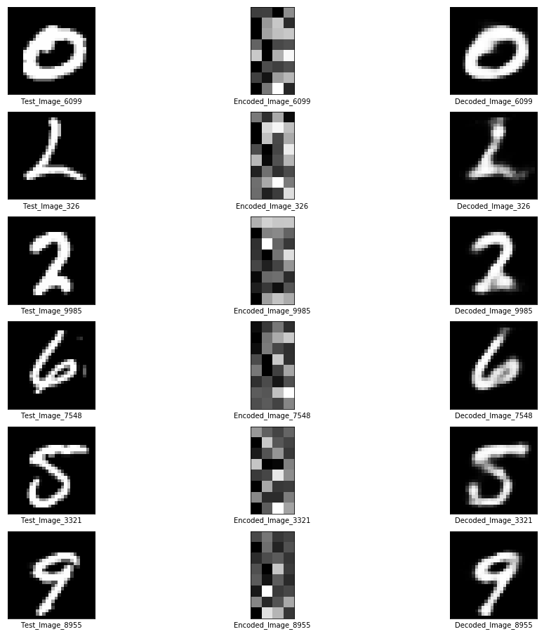
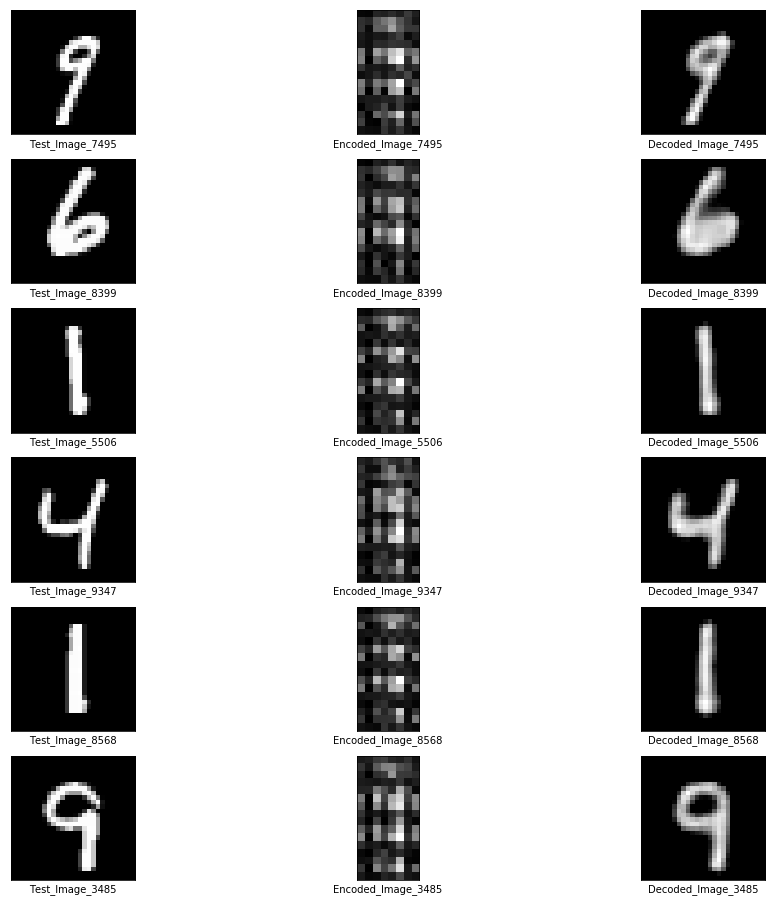

# Autoencoders

**Autoencoding** is a data compression algorithm where the compression and decompression functions are
1. data-specific
2. lossy
3. learned automatically from examples rather than engineered by a human.

In almost all contexts where the term **Autoencoder** is used, the compression and decompression functions are implemented with neural networks.

### [1. Simple Autoencoder](./1_Simple_Autoencoder/simple-autoencoder.ipynb)

The simples possible Autoencoder in which the encoder and decoder consists of a single fully-connected layer each.

### [2. Deep Autoencoder](./2_Deep_Autoencoder/deep-autoencoder.ipynb)

A Deep Autoencoder in which both the encoder and decoder consists of multiple fully-connected layer each.

### [3. Deep Convolutional Autoencoder](./3_Deep_Convolutional_Autoencoder/deep-convolutional-autoencoder.ipynb)

A Deep Autoencoder in which both the encoder and decoder consists of multiple fully-convolutional layer each.

